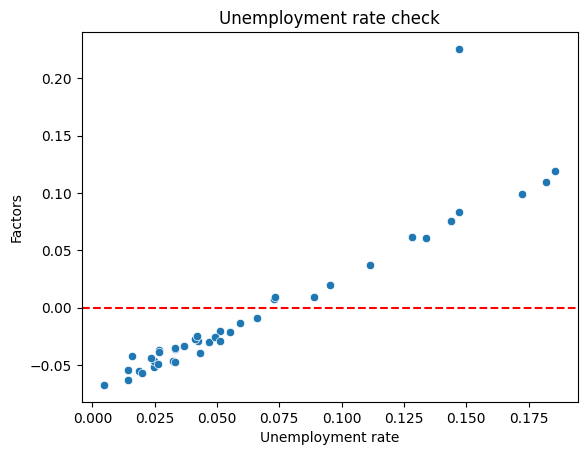

# Unveiling-Economic-Trends-Unemployment-Prediction-with-Multi-Linear-Regression

In an ever-changing economic landscape, the ability to anticipate and understand unemployment trends is crucial for policymakers, businesses, and individuals alike. This project harnesses the power of machine learning and data analysis to forecast unemployment rates based on a range of influential factors, providing actionable insights into labor market dynamics.

Project Overview:
This repository hosts a comprehensive unemployment prediction model developed using multi-linear regression. By considering factors such as a country's GDP, population density, agricultural land utilization, and urban population, the model offers a holistic view of the intricate relationships affecting employment rates.

Key Features:

Data-driven Insights: Explore the intricate interplay between economic indicators and unemployment rates to uncover patterns and trends.
Predictive Accuracy: Leveraging advanced multi-linear regression techniques, the model provides accurate forecasts that aid in decision-making.
Interactive Visualization: Visualize historical trends, predicted values, and regression analyses to gain a deeper understanding of the data.
Scalability: The project's modular structure makes it easy to scale and adapt to new datasets or additional influencing factors.
Why This Matters:
Understanding unemployment trends empowers governments to formulate effective policies, businesses to make informed hiring decisions, and individuals to plan for the future. By providing accurate predictions, this project contributes to economic stability and empowers stakeholders to navigate the complexities of labor markets with confidence.

How to Contribute:
Contributions to this project are welcome! Whether you're interested in improving the model's accuracy, enhancing visualizations, or expanding the list of influencing factors, your expertise can help refine our understanding of unemployment dynamics.

Join us on the journey to unlock insights that drive economic prosperity. Clone the repository, explore the codebase, and contribute your insights to shape the future of unemployment prediction.